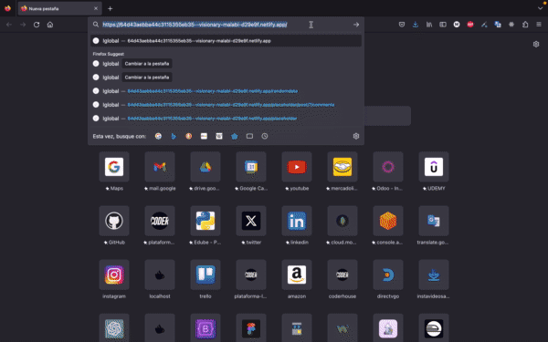

# Desafio Iglobal Ventures SpA
## Desafio Frontend - Manuel Esteban Florez Lopez

Este es mi entregable para el desafio frontend de Iglobal Ventures SpA.
Primero detallaré lo que hice en cada etapa y cual fue la solucion que escogí. Luego explicaré un poco más sobre este proyecto en React.js que desarrolle.

## Primera etapa
Lo que primero hice fue analizar cada diseño para buscarle una solucion a la hora de maquetar. 
Maqueté la prueba numero dos, usando HTML y CSS.
Creé un repositorio para esta solución y les dejo las imágenes del resultado, el link del repositorio y el link de gihub-Pages para esta primera etapa.


[GitHub](https://github.com/manuel14mds/webchallenge) - Repositorio de GitHub de la primera etapa.

[GitHub-page](https://manuel14mds.github.io/webchallenge/) - Repositorio de GitHub pages de la primera etapa.


## Segunda etapa
Para la segunda etapa escogí la biblioteca React.js.
Lo primero que hice fue integrar el código de la primera prueba en un nuevo proyecto con react.
Luego para poder navegar por las proximas funciones añadí una barra de navegación y esta vez me apoyé en react-bootstrap y bootstap. 
Usé todas las tres APIs para demostrar mis habilidades y comprención de como se comporta react con el ciclo de vida de los componentes.


## tercera etapa
Utilicé placeholder API para mostrar datos en pantalla, en este caso de publicaciones y luego medinate un botón ver en detalle los comentarios de cada publicación. 
La API  random-data-api la utilizo para demostrar varias peticiones en una misma pagina. Que cada una de estos componentes puedan refrescar la informacion por medio de un botón.
La ultima API la utilizo para buscar un dato ingresado por formulario y mostrar la informacion en pantalla. Con La pestaña de PokeApi buscamos un pokemón y si es correcto, nos brinda los detalles e imagenes.
Me encargé de hacer validaciones para que el codigo no se rompa y no de mala impresion al usuario. 
Todo el proyecto fué desarrollado de manera responsiva. Aplicando mobile-first para una mejor optimizacion en los dispositivos mobiles.



## concluciones del desafío
Tengo que admitir que estuve ocupado estos dias. Sentía una presión por no haber podido empezar pronto, pero todo eso fue mermando a medida que iba codeando. Realmente disfruté de este desafío. Me gustó como quedó el entregable y me demostró que tengo muchas habilidades.
Ahora los dejo con las especificaciones del proyecto.

## Tecnologias
Las tecnologias usadas son HTM5, CSS3, Bootstrap para el maquetado y como librería usé React.js Con la version liviana de Vite.
Hago uso de React-Bootstrap y Bootstrap vanilla para el maquetado.
React-router-dom para la navegación dentro del SPA.
utilizo useState para guardar los estados de los componentes y useEfect para contemporizar el ciclo de vida del componente.
Para las peticiones a las APIs uso Fetch nativo.


## Installation
Ovbiando la clonación de un proyecto desde github, Por ser un proyecto desarrollado en React.js tenemos que tener instalado Node en nuestra computadora. este proyecto fue desarrollado en la version 18.10.0 de node.js.
Estando en la raiz de duestro proyecto en nuestra terminal, debemos instalar todas las dependencias del proyecto para después poder correrlo.

```sh
npm install
npm run dev
```
| PACKAGE  | VERSION |
| ------ | ------ |
| bootstrap | v 5.3.1 |
| react | v 18.2.0 |
| react-botstrap | v 2.8.0 |
| react-dom | v 18.2.0 |
| react-router-dom | v 6.14.2 |


## Deploy
Este proyecto en Netlify
[deploy](https://64d43aebba44c3115355eb35--visionary-malabi-d29e9f.netlify.app/) - Puedes ver la aplicación web desde aquí

## License
**Free Software, Hell Yeah!**
